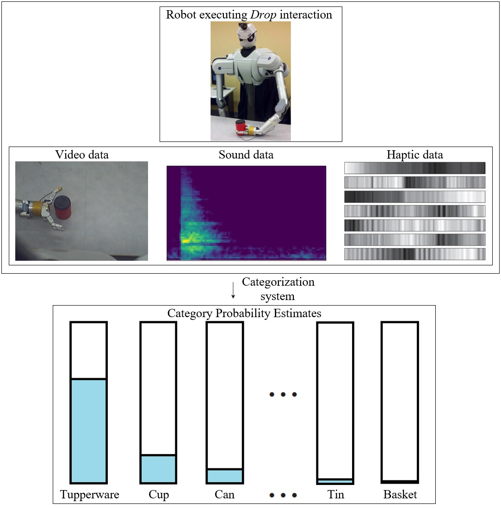
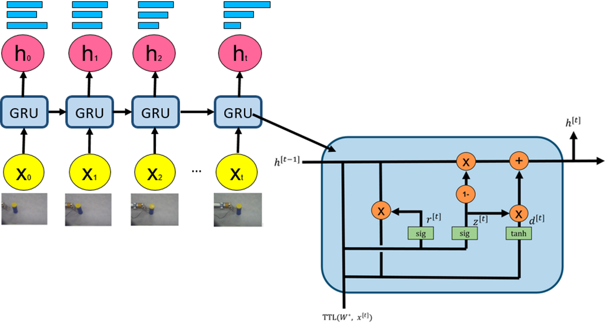
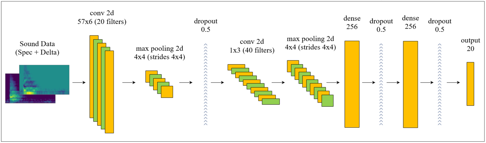
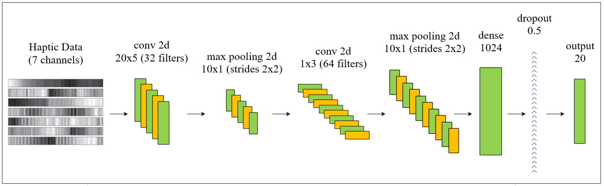
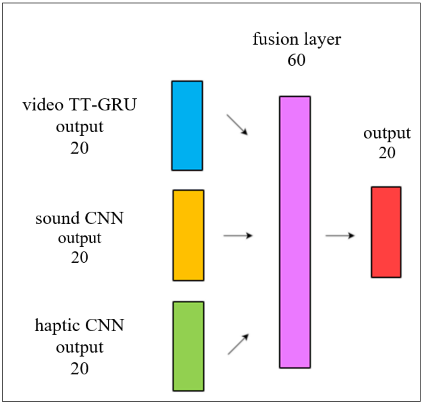
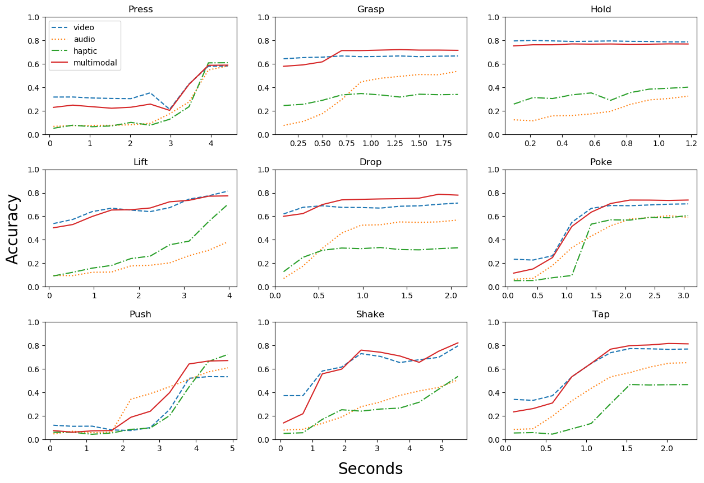
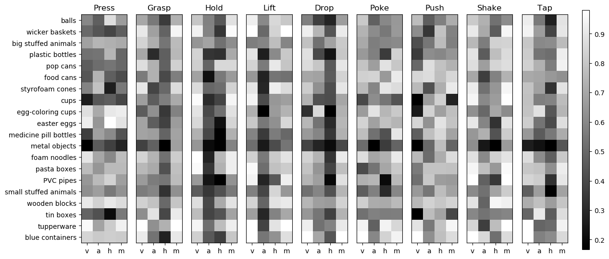

# Deep Multi-Sensory Object Category Recognition Using Interactive Behavioral Exploration

**Abstract:**

> When identifying an object and its properties, humans use features from multiple sensory modalities produced when manipulating the object.
Motivated by this cognitive process, we propose a deep learning methodology for object category recognition which uses visual, auditory, and haptic sensory data coupled with exploratory behaviors (e.g., grasping, lifting, pushing, etc.).
In our method, as the robot performs an action on an object, it uses Tensor-Train Gated Recurrent Unit network to process its visual data, and Convolutional Neural Networks to process haptic and auditory data.
We propose a novel strategy to train a single neural network that inputs video, audio and haptic data, and demonstrate that its performance is better than separate neural networks for each sensory modality.
The proposed method was evaluated on a dataset in which the robot explored 100 different objects, each belonging to one of 20 categories.
While the visual information was the dominant modality for most categories, adding the additional haptic and auditory networks further improves the robot's category recognition accuracy.
Our approach outperforms the previous published baseline for the dataset which used hand-crafted features for each modality.
We also show that a robot does not need the sensory data from the entire interaction, but instead can make a good prediction early on during behavior execution.

## Development Environment
For our research, we used 64-bit Ubuntu 16.04 based computer with 16 GB RAM, Intel Core i7-7700 CPU (3.20 GHz x 8 cores) and NVIDIA GeForce GTX 1060 (3GB RAM, 1280 CUDA Cores).
Data pre-processing was performed using `Python 3.5.4` and neural networks were implemented in widely used deep learning framework `TensorFlow 1.7` with GPU support (cuDNN 7, CUDA 9).

## Dependencies

`Python 3.5.4` is used for development and following packages are required to run the code:  
`pip install tensorflow-gpu==1.8.0` 
`pip install keras==2.2.0` 
`pip install matplotlib==2.2.2` 
`pip install numpy==1.14.5` 
`pip install googledrivedownloader`

## Dataset

- [Visualization of each modalities](DatasetVisualization.ipynb)

## Video Classification

### Video Network Hyper-parameters

The input dimension at each time step is 120 x 90 x 3 = 32,400 which is factorized as 2 x 90 x 90 x 2, the hidden layer is chosen to be 6 x 6 x 6 x 6 = 1,296 and the Tensor-Train ranks are [1, 4, 4, 4, 1].
A fully-connected layer for such a mapping would have required 41,990,400 (32,400 x 1,296) parameters to learn, however the input-to-hidden layer in TT-GRU required only 17,472 parameters.

We applied 0.25 Dropout for both input-to-hidden and hidden-to-hidden mappings in plain GRU as well as its TT modifications; and 0.01 ridge regularization for the single-layered classifier.
The model was deployed in Keras and TensorFlow was used as backend.
We trained for 150 epochs and used the Adam, an gradient-based stochastic optimization algorithm with a learning rate of 1 x 10^{-4}.

- [Training](VideoNetworkTraining.ipynb)
- [Testing](VideoNetworkTesting.ipynb)

## Sound Classification

### Sound Network Hyper-parameters

We applied dropout with 0.5 probability for fully connected layers and the first convolutional layer.
We trained our network using Adam optimization, with a learning rate 1 x 10^{-4} and stopped training after 300 iterations.

- [Training](SoundNetworkTraining.ipynb)
- [Testing](SoundNetworkTesting.ipynb)

## Haptic Classification

### Haptic Network Hyper-parameters

To reduce over-fitting during training, we used dropout after the fully connected layer with 0.5 probability.
Training was performed with 400 training epochs using Adam optimization with a learning rate of 1 x 10^{-4}.

- [Training](HapticNetworkTraining.ipynb)
- [Testing](HapticNetworkTesting.ipynb)

## Multimodal Classification

### Multimodal Network Hyper-parameters

This network was trained for 300 epochs using Adam optimization with learning rate 1 x 10^{-4}.

- [Training](MultimodalNetworkTraining.ipynb)
- [Testing](MultimodalNetworkTesting.ipynb)

## Results

### Accuracy curve for all the interactions and sensory modalities

### Recognition F-score for each category behavior, and sensory modality: (v)isual, (a)uditory, (h)aptic and (m)ultimodal

# Alternate Configurations 

Alternate Network Architecture for Video, Sound, Haptic, and Multimodal Networks are discussed here: [Alternate Configurations](AlternateConfigurations.ipynb)
